# Cabinet Studio

Cabinet Studio is a browser-based cabinet design tool for quickly modelling cabinet carcasses, doors, drawers, shelves, hardware drilling, and exportable panel geometry.

It is focused on turning cabinet dimensions and construction choices into a visual 3D preview, panel previews, and DXF output for fabrication.

## Live App

https://petervanderwalt.github.io/cabinet-studio/

## Overview

Cabinet Studio gives you a single browser workspace for cabinet sizing, front configuration, drilling decisions, 3D review, and fabrication exports.

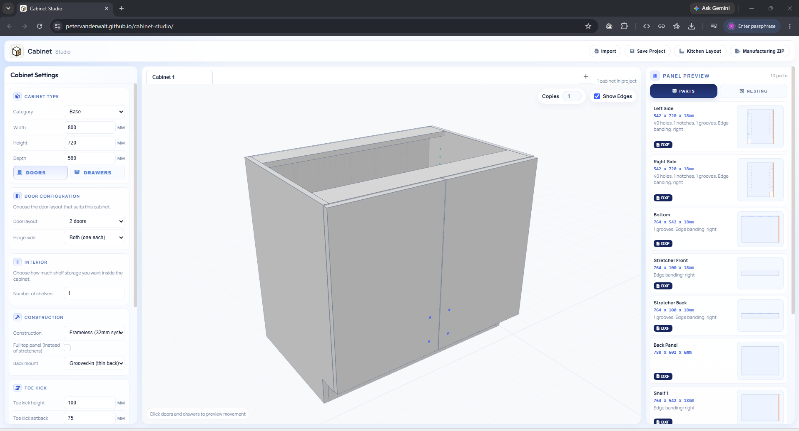

## Features

- Parametric cabinet dimensions for width, height, depth, materials, overlay, reveal, toe kick, and construction style.
- Door and drawer configurations with animated 3D preview.
- Shelf pin, hinge plate, drawer runner, and drawer slide reference hole generation.
- Panel preview sidebar with 2D previews for each generated part.
- Individual panel DXF export and full cabinet ZIP export.
- Local-only static app: no build step required.

## Cabinet Layouts

You can switch between open shelving, door-based cabinets, and drawer stacks without leaving the same design flow.

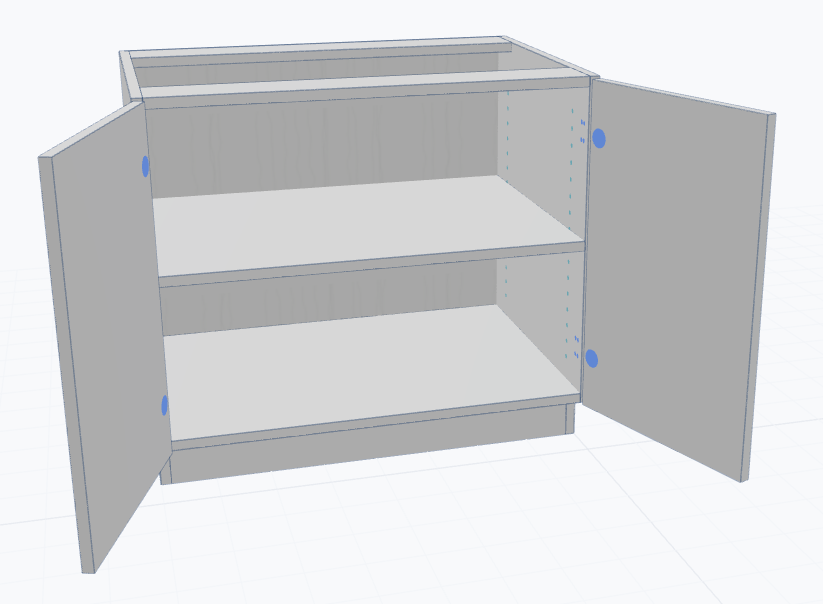
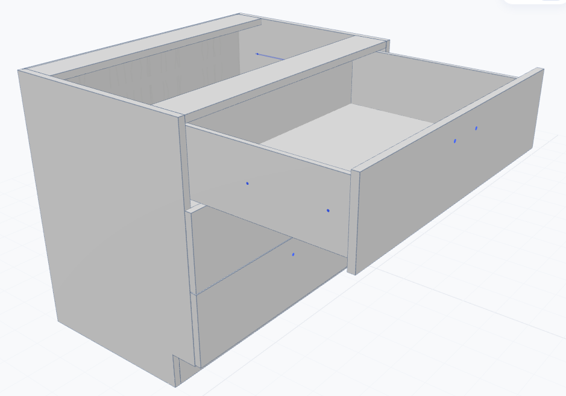

## Nesting And Materials

Material-aware nesting helps separate parts by sheet stock so machining output stays organized when a project uses more than one board type or thickness.

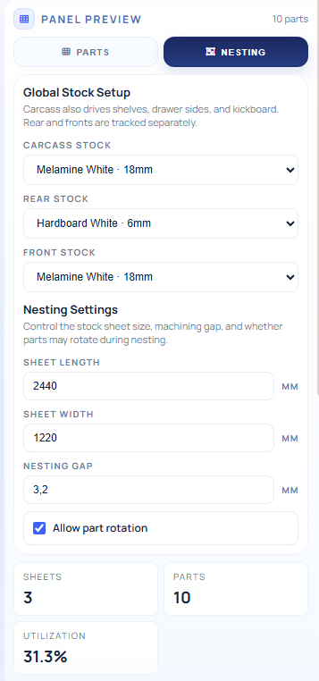
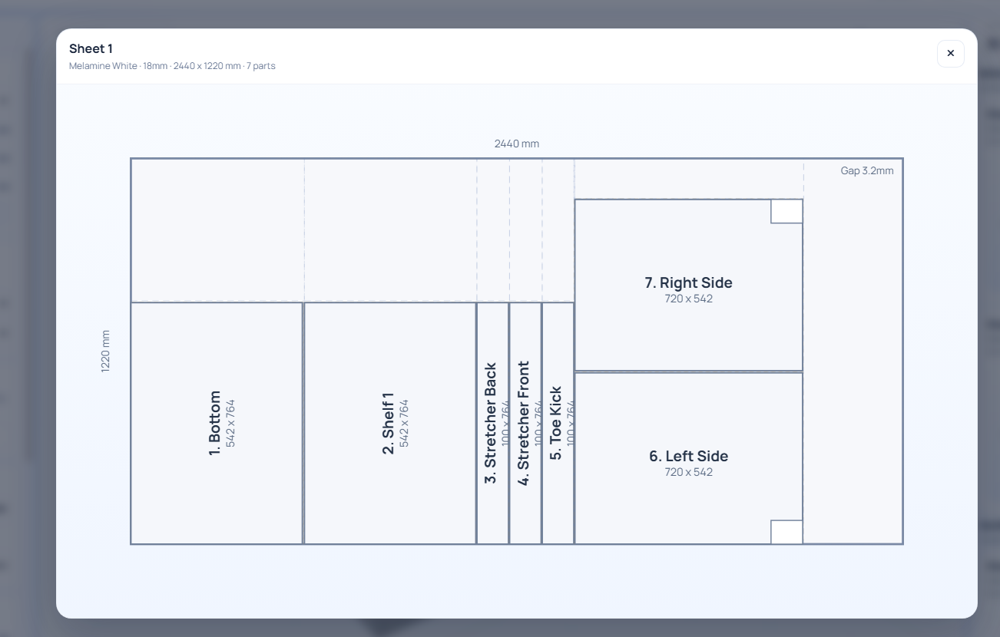

## Hardware Configuration

Hardware settings are configurable at project level, including drawer sliders, handles, and hinges, so drilling and clearances track the construction method you plan to build.

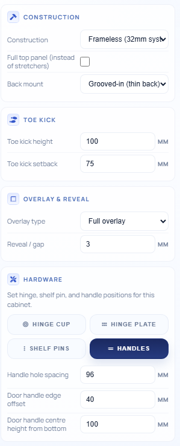

## Multi-Cabinet Projects

Larger jobs can be assembled as multi-cabinet projects, with copy counts for repeated units so one design can drive a full run of matching cabinets.

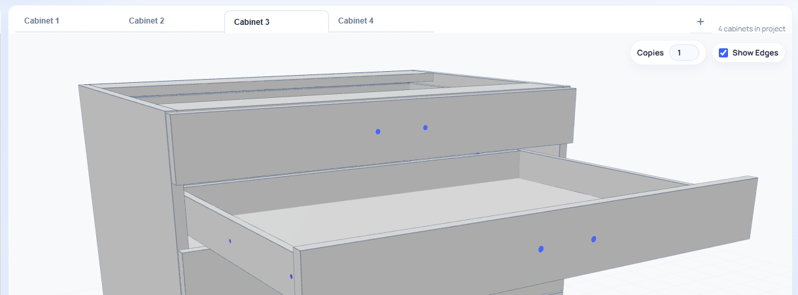

## Upcoming: Kitchen Layout Planning

An upcoming layout-planning view will extend Cabinet Studio from single-cabinet configuration into room-level arrangement, making it possible to place cabinets in a broader kitchen layout and render the overall plan before fabrication.

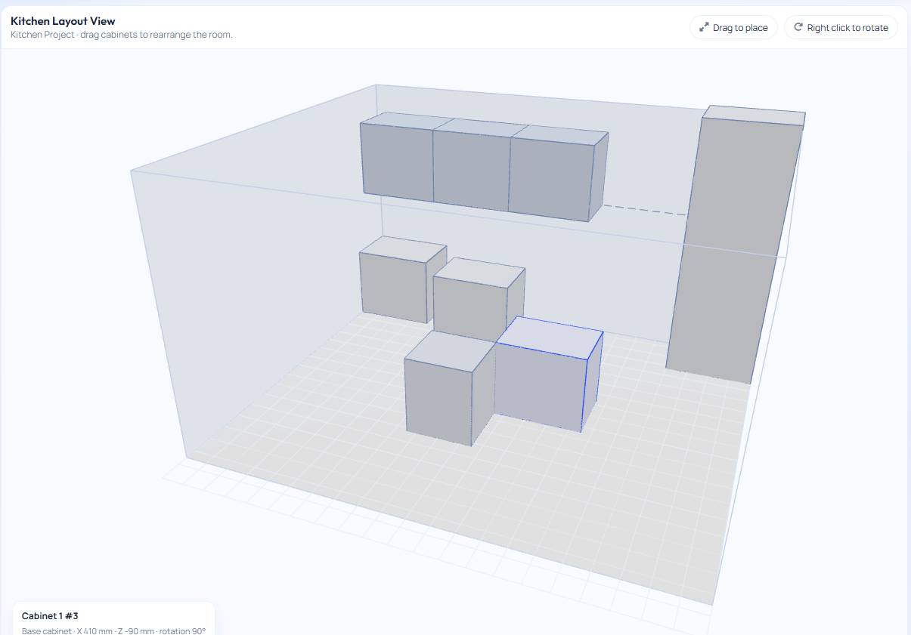

## Manufacturing Export

Cabinet Studio can export individual DXFs, nested DXFs, and a manufacturing ZIP bundle so the machining package is ready to hand off or archive as a single deliverable.

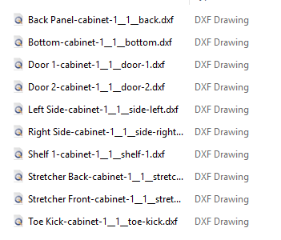
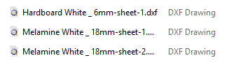
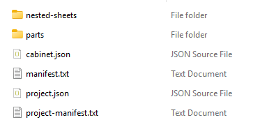

## Running Locally

Because the app uses ES modules, open it through a local web server rather than directly from the filesystem.

From this folder:

```powershell
python -m http.server 8080
```

Then open:

```text
http://127.0.0.1:8080/
```

The app loads Three.js from the import map in `index.html`, so an internet connection is currently required for the 3D viewer dependency.

## Project Structure

- `index.html`: App shell, styles, import map, and main layout.
- `assets/`: Cabinet Studio logo and favicon assets.
- `js/main.js`: App entry point, panel list rendering, import/export wiring.
- `js/cabinet-math.js`: Pure cabinet geometry and panel generation.
- `js/form-ui.js`: Cabinet settings form and configuration state.
- `js/three-viewport.js`: 3D preview rendering and animations.
- `js/dxf-writer.js`: DXF and ZIP export generation.
- `lib/jszip.min.js`: Local JSZip dependency for ZIP exports.

## Notes

Cabinet geometry is still evolving. Verify generated DXF drilling and panel dimensions against the intended hardware before cutting real material.
